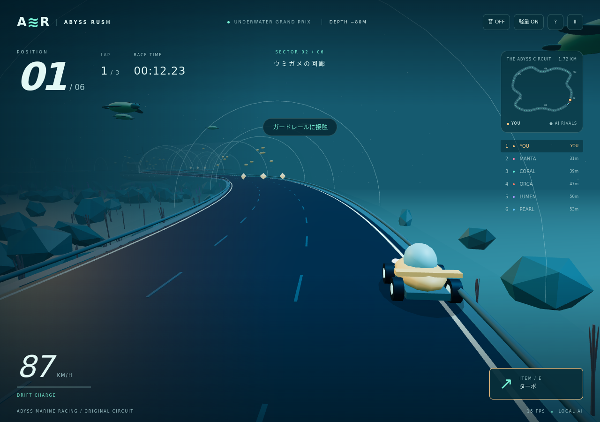

# ABYSS RUSH — 海底グランプリ — デモ動画

[動画を開く](kart-rush.webm) · [自動確認ログ](kart-rush.json)

- 撮影日: 2026-10-07（日本時間）
- 長さ: 32.00秒
- 容量: 3.78 MiB
- 形式: VP8 / WebM、1280×900、25fps（エンコード設定）、無音
- URL: `http://127.0.0.1:5173/react-laboratory/#/experiments/kart-rush`
- アプリのコミット: `8d253a33581d454300dbe0048b8885a6ebf73c43`

## 操作と確認結果

- やさしい難易度・軽量表示でレース開始
- racing状態への遷移を確認
- コース図に6台が存在し、位置が変化することを確認
- 左右キーを入力、一時停止ダイアログ表示、レース再開

上記の自動状態確認は成功。コンソールエラー・警告・失敗したリクエストは0件。動画の全体デコードも成功しました。序盤・中盤・終盤の抽出フレームを目視確認しています。

## 制約

自動アクセルON。走行中のガードレール接触もそのまま記録しています。ゴール、アイテム、ドリフト、AI判断の正しさは未検証です。

[共通の撮影条件・再撮影時の注意](recording-notes.md)を参照してください。
