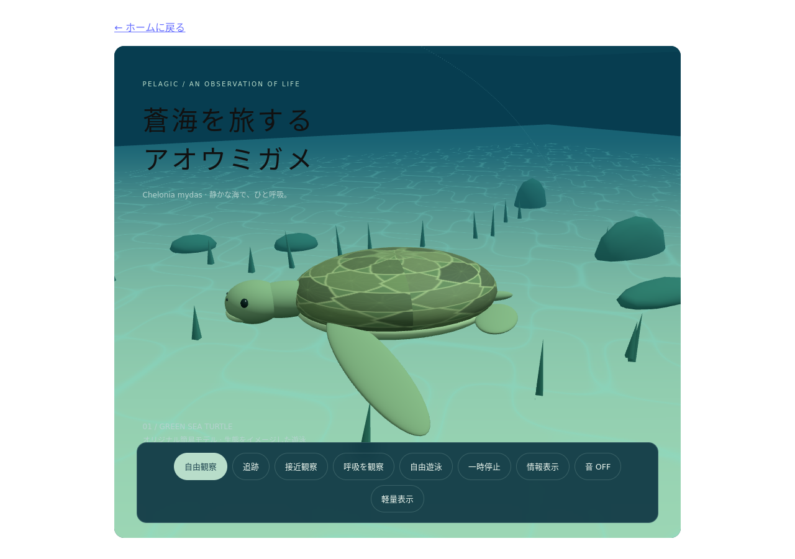

# アオウミガメ — デモ動画

[動画を開く](sea-turtle.webm) · [自動確認ログ](sea-turtle.json)

- 撮影日: 2026-10-07（日本時間）
- 長さ: 31.16秒
- 容量: 3.65 MiB
- 形式: VP8 / WebM、1280×900、25fps（エンコード設定）、無音
- URL: `http://127.0.0.1:5173/react-laboratory/#/experiments/sea-turtle`
- アプリのコミット: `8d253a33581d454300dbe0048b8885a6ebf73c43`

## 操作と確認結果

- 3D描画の準備完了
- 追跡モードを選択し、選択状態を確認
- 接近観察で「前ヒレ」の情報を表示
- 呼吸観察の操作、一時停止・再生

上記の自動状態確認は成功。コンソールエラー・警告・失敗したリクエストは0件。動画の全体デコードも成功しました。序盤・中盤・終盤の抽出フレームを目視確認しています。

## 制約

泳ぎと視点の変化を抽出フレームで目視確認。生態の正確さや呼吸周期の再現は検証していません。

[共通の撮影条件・再撮影時の注意](recording-notes.md)を参照してください。
