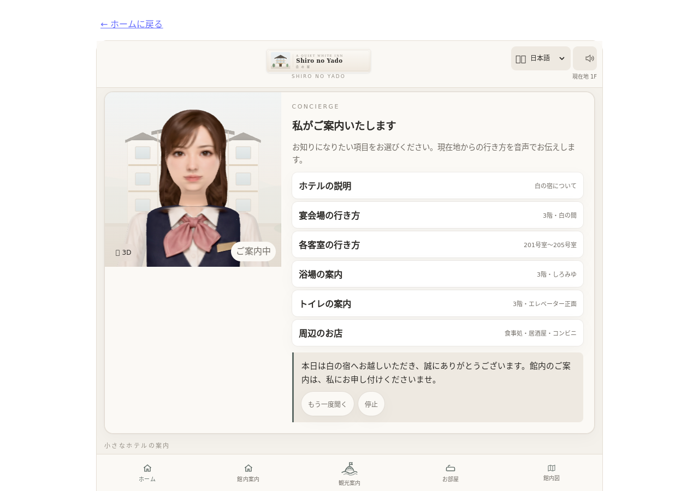

# 白の宿 — デモ動画

[動画を開く](shiro-yado.webm) · [自動確認ログ](shiro-yado.json)

- 撮影日: 2026-10-07（日本時間）
- 長さ: 32.40秒
- 容量: 2.51 MiB
- 形式: VP8 / WebM、1280×900、25fps（エンコード設定）、無音
- URL: `http://127.0.0.1:5173/react-laboratory/#/experiments/shiro-yado`
- アプリのコミット: `8d253a33581d454300dbe0048b8885a6ebf73c43`

## 操作と確認結果

- コンシェルジュの3Dモデル準備完了を確認
- 「浴場の案内」を選択し、選択状態と案内ボタンを確認
- 浴場ページを開き、「しろみゆ」の見出しを確認
- ホームに戻り、3Dモデルの準備完了を確認

上記の自動状態確認は成功。コンソールエラー・警告・失敗したリクエストは0件。動画の全体デコードも成功しました。序盤・中盤・終盤の抽出フレームを目視確認しています。

## 制約

コンシェルジュと浴場の3D描画を目視確認。無音録画のため、音声案内の品質や口パク同期は確認していません。

[共通の撮影条件・再撮影時の注意](recording-notes.md)を参照してください。
