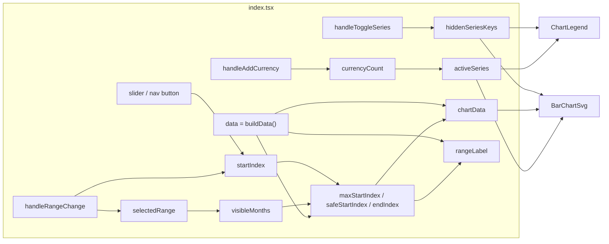
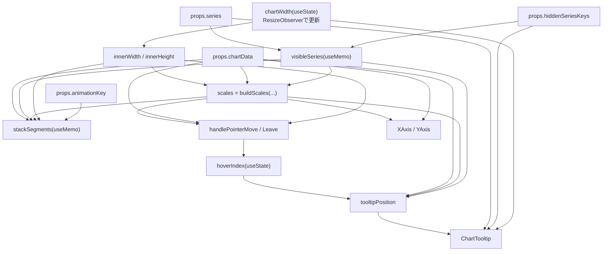

# currency-chart-window-lab-scratch Reactオブジェクト依存性資料

この資料は `src/experiments/currency-chart-window-lab-scratch` 配下の、Reactコンポーネント・状態・補助モジュールの依存関係を整理したものです。

## 1. モジュール依存関係（importベース）

```mermaid
graph TD
  index["index.tsx<br/>CurrencyChartWindowLabScratch"]
  types["types.ts<br/>型・定数"]
  data["data.ts<br/>buildData"]
  barsvg["chart/BarChartSvg.tsx"]
  legend["chart/legend.tsx<br/>ChartLegend"]
  axes["chart/axes.tsx<br/>XAxis / YAxis"]
  tooltip["chart/tooltip.tsx<br/>ChartTooltip"]
  scales["chart/scales.ts<br/>buildScales"]
  style["styles.css"]

  index --> types
  index --> data
  index --> barsvg
  index --> legend
  index --> style

  data --> types

  barsvg --> types
  barsvg --> axes
  barsvg --> tooltip
  barsvg --> scales

  axes --> types
  legend --> types
  tooltip --> types
  scales --> types
```

## 2. Reactオブジェクト（状態/派生値/イベント）の依存関係

`index.tsx` が状態管理のハブです。`BarChartSvg` と `ChartLegend` は主に props 経由で同じ状態を共有します。



## 3. BarChartSvg内部の依存関係

`BarChartSvg.tsx` は「レイアウト計測 → スケール生成 → 積み上げセグメント生成 → hover計算 → Tooltip表示」という順序で依存します。



## 4. 役割分担の要約

- `types.ts`
  - 系列定義（`CURRENCY_SERIES`）と `ChartRow` などの共通型を提供する「依存の基点」。
- `data.ts`
  - `buildData` によって時系列データを生成。画面の初期表示と期間切り出しの母集団になる。
- `index.tsx`
  - UI状態（表示期間、開始位置、非表示系列、系列数）を保持し、表示用データを集約計算。
- `chart/BarChartSvg.tsx`
  - 可視系列のみでスケール計算し、積み上げ棒と hover tooltip を描画。
- `chart/axes.tsx` / `chart/tooltip.tsx` / `chart/legend.tsx`
  - 単機能コンポーネントとして分離され、`index.tsx` または `BarChartSvg.tsx` の計算結果を表示。

## 5. 変更時の影響ポイント

- 系列追加/削除（`types.ts` の `CURRENCY_SERIES`）
  - `buildData`、凡例、棒描画、tooltip 表示のすべてに伝播。
- 期間選択ロジック変更（`index.tsx` の `selectedRange` / `startIndex`）
  - `chartData` の切り出し条件とスライダー上限に直結。
- 棒グラフ計算変更（`chart/scales.ts` と `BarChartSvg.tsx`）
  - 軸・バー高さ・hoverの当たり判定に同時影響。
